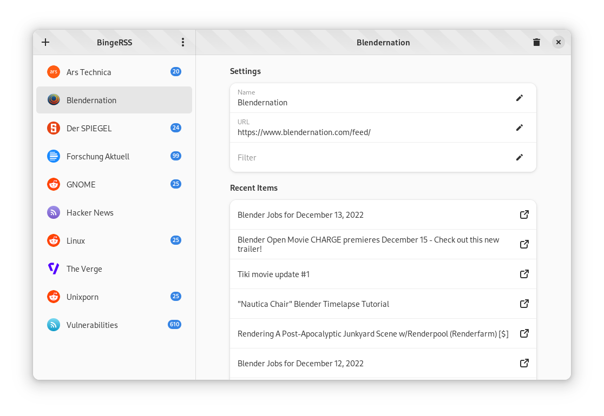

<!--
SPDX-FileCopyrightText: Simon Schneegans <code@simonschneegans.de>
SPDX-License-Identifier: CC-BY-4.0
-->


<p align="center">
  
</p>

<h1 align="center">📚 BingeRSS</h1>

<p align="center">
<a href="https://github.com/Schneegans/binge-rss/actions"></a>
<!-- <a href="https://api.reuse.software/info/github.com/Schneegans/binge-rss"></a> -->
<a href="LICENSE"></a>
<a href="tools/cloc.sh"></a>
<a href="tools/cloc.sh"></a>
</p>

<p align="center">A mimalistic RSS reader for fast, filtered, high-volume news feeds.</p>

:warning: _My primary motivation for developing BingeRSS is to learn rust, gtk-rs, meson, and flatpak application development. Hence, it will stay very minimalistic. There are much more feauture-rich alternatives available. However, AFAIK there are no feed readers available which allow filtering new-feed notifications. Therefore, I'll try my best to make this application as usable as possible._

## :construction: TODO List

BingeRSS is still under heavy development.
Expect bugs!
In its current state, it is not yet very useful.
However, once this list is completed, I'll publish the first release:

- [x] Configure new feeds.
- [x] Make the name and URL of the feeds configurable.
- [x] Allow deletion of feeds.
- [x] Allow undo deletion of feeds.
- [x] Permanently store configured feeds.
- [x] Allow filtering of feed items by their name.
- [x] Show the number of new feed items since the last start of the app.
- [ ] Automatically refresh feeds at periodic intervals.
- [ ] Keep the app running in the background even if the window gets closed.
- [ ] Show notifications whenever a new feed item is published.

## ⬇️ Local Installation

For now, you have to compile BingeRSS yourself, as no binary packages are distributed.
Once the first version is released, there will be binary packages.

#### Download Dependencies

```bash
sudo apt install meson libgtk-4-dev libadwaita-1-dev desktop-file-utils
```

#### Building

```bash
meson setup _build/release --buildtype=release --prefix=`pwd`/_install/release
meson install -C _build/release
```

#### Running

```bash
XDG_DATA_DIRS=$XDG_DATA_DIRS:`pwd`/_install/release/share ./_install/release/bin/binge-rss
```

## :package: Flatpak Installation

Alternatively, you can create a flatpak package and install it locally.

#### Building & Installing

```bash
meson setup _build/release --buildtype=release --prefix=`pwd`/_install/release
meson dist -C _build/release
flatpak-builder --user --install --force-clean --install-deps-from=flathub _repo tools/io.github.schneegans.BingeRSS.json
```

#### Running

```bash
flatpak run io.github.schneegans.BingeRSS
```

## :beetle: Debug Configuration

If you quickly want to add some feeds for development purposes, you can write this to GSettings key `/io/github/schneegans/BingeRSS/feeds`.

```json
[{"title":"Der SPIEGEL","url":"https://www.spiegel.de/schlagzeilen/tops/index.rss","viewed":0,"filter":""},{"title":"Unixporn","url":"http://reddit.com/r/unixporn/new/.rss?sort=new","viewed":0,"filter":""},{"title":"Forschung Aktuell","url":"https://www.deutschlandfunk.de/forschung-aktuell-104.xml","viewed":0,"filter":""},{"title":"Linux","url":"http://reddit.com/r/linux/new/.rss?sort=new","viewed":0,"filter":""},{"title":"GNOME","url":"http://reddit.com/r/gnome/new/.rss?sort=new","viewed":0,"filter":""},{"title":"OMG Ubuntu","url":"https://omgubuntu.co.uk/feed","viewed":0,"filter":""},{"title":"Blendernation","url":"https://www.blendernation.com/feed/","viewed":0,"filter":""},{"title":"The Verge","url":"https://www.theverge.com/rss/index.xml","viewed":0,"filter":""},{"title":"Ars Technica","url":"https://feeds.arstechnica.com/arstechnica/features","viewed":0,"filter":""},{"title":"Hacker News","url":"https://news.ycombinator.com/rss","viewed":0,"filter":""},{"title":"Vulnerabilities","url":"https://nvd.nist.gov/feeds/xml/cve/misc/nvd-rss-analyzed.xml","viewed":0,"filter":""}]
```